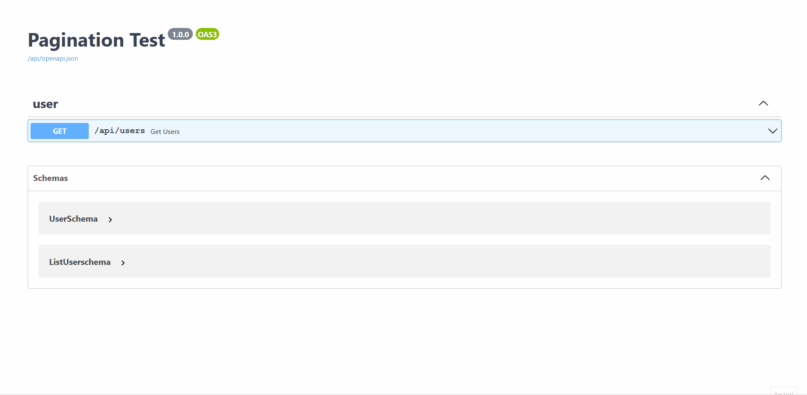

# **Pagination**

**Django Ninja Extra** Pagination decorator gives you more pagination information, and it is very extensible.

## **Usage**
```python
from ninja_extra.pagination import paginate, PageNumberPaginationExtra
from ninja_extra import router, APIController, route, NinjaExtraAPI
from ninja import ModelSchema
from django.contrib.auth import get_user_model

user_model = get_user_model()


class UserSchema(ModelSchema):
    class Config:
        model = user_model
        model_fields = ['username', 'email']

        
@router('/users')
class UserController(APIController):
    @route.get('', response=PageNumberPaginationExtra.get_response_schema(schemas.UserSchema))
    @paginate(PageNumberPaginationExtra, page_size=50)
    def get_users(self):
        return user_model.objects.all()

    
api = NinjaExtraAPI(title='Pagination Test')
api.register_controllers(UserController)
```


