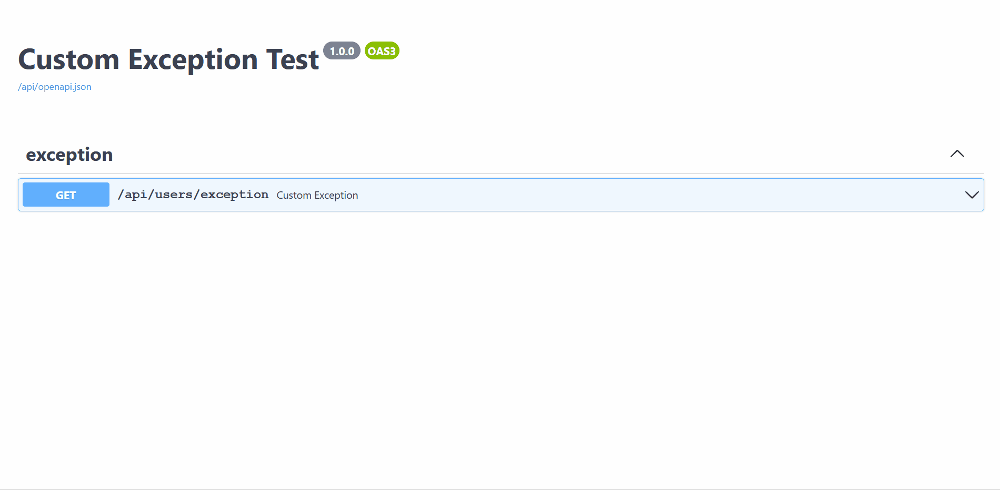

# **Custom Exception**
**Django-Ninja** provides an intuitive way of handling custom exceptions by registering a function(handler) against an Exception type, just like it's done in a Flask app.

So in that sense, **Django-Ninja-Extra** has an `APIException` exception type which provides similar functionalities, for those use to DRF `APIException`.

For Example: 
```python
from ninja_extra.exceptions import APIException
from ninja_extra import api_controller, route, NinjaExtraAPI, status
from ninja import constants


class CustomAPIException(APIException):
    status_code = status.HTTP_401_UNAUTHORIZED
    message = 'UnAuthorized'

    
@api_controller('', tags=['My Operations'], auth=constants.NOT_SET, permissions=[])
class MyController:
    @route.get('/exception')
    def custom_exception(self):
        raise CustomAPIException()


api = NinjaExtraAPI(title='Exception Test')
api.register_controllers(MyController)
```
